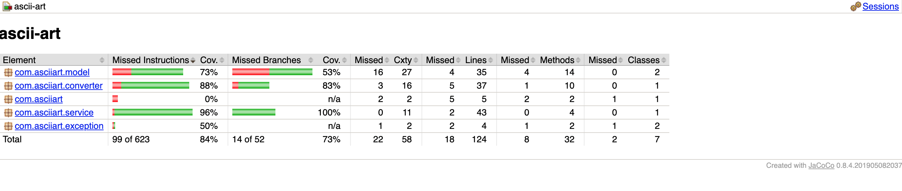

# ASCII Art

ASCII renderer of maps based on latitude and longitude in pure java with no external dependencies.

## Download and Running
```
    git clone https://github.com/p-malik/asciiart.git
    mvn clean install
    java -jar target/ascii-art-1.0-SNAPSHOT.jar
```

## Assumptions
- The input file is located in src/main/resources and is always a zip file with csv file which follows the format `id,postcode,latitude,longitude` as heading  followed by the data entries.
- All the coordinated in the csv file aren't valid, so the invalid ones are ignored.
- We are using mercator spherical earth formula for providing more simplicity in the calculations, with a small compromise on the accuracy, as it's not a large scale map
- we are using java Graphics 2D API with pixel configurations for scaling the map and ascii-art is displayed randomly with 2 ascii chars.

## Notes
### 

## Design
- The  issue with plotting maps is that the spherical surface of the Earth cannot be conveniently converted into a flat representation. There are a bunch of different projections that attempt to resolve this.
-  is one of the simplest: it assumes that lines of equal latitude are parallel horizontals, while lines of equal longitude are parallel verticals. 
- We are using the  Mercator spherical earth projection formula to convert the longitude/latitude to X/Y
- API from java Graphics2D is used to draw the map easily.
- The image map is based on the width and height in pixel
- The program saves image and prints ascii-art on the terminal.
- We are randomly using 2 ascii characters to display the ascii-art


## Coverage



 